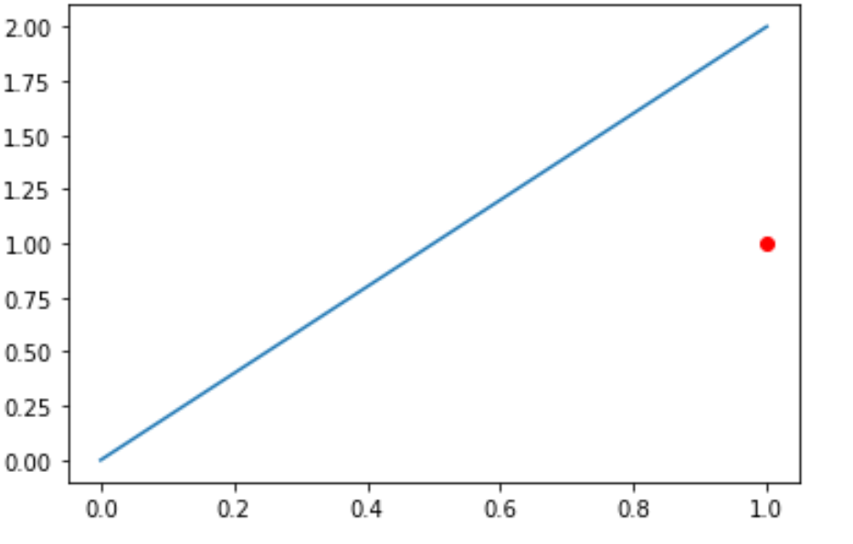

[TOC]

# 几何

## 点到直线距离


$$
cos \theta =  \frac{v1^T v2}{|v1||v2|} \\
d = |v1| * sin(\theta)
$$

```python
import math
def norm(v):
    return math.sqrt(v[0]**2 + v[1] ** 2)
def mul(a, b):
    return a[0] * b[0] + a[1] * b[1]
def angle(a, b):
    return math.acos(mul(a, b) / (norm(a)* norm(b)))
def p2line_dis(x, a, b):
    v1 = [a - b for a, b in zip(x, pa)]
    v2 = [a - b for a, b in zip(pb, pa)]
    theta = angle(v1, v2)
    return norm(v1) * math.sin(theta)
x, pa, pb = [1,1],[0,0],[1,2]
p2line_dis(x, pa, pb)
```


## 快速幂

$x^y$

```c++
int exp_2(int y){
		return 0x01 << y;
}
int exp(int x, int y){
  long long res = 1;
  while (y > 0) {
    if (y & 1) res = res * x;
    x = x * x;
    y >>= 1;
  }
  return res;
}
```


如果底数位置