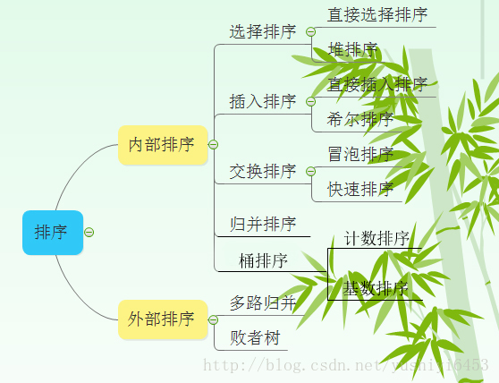
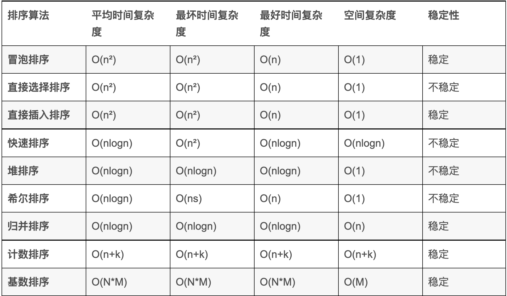

[TOC]


# 递归式复杂度分析

- $T(n) = aT(\frac{n}{b}) + c n^ k$


# 常用排序时间复杂度





>1 归并排序可以通过手摇算法将空间复杂度降到O(1)，但是时间复杂度会提高。
>
>2 基数排序时间复杂度为O(N*M)，其中N为数据个数，M为数据位数。


##### 冒泡

```python
def bubble(arr):
    for i in range(len(arr) - 1, -1, -1):
        cnt_change = 0
        for j in range(1, i):
            if arr[j] < arr[j - 1]:
                arr[j], arr[j-1] = arr[j-1], arr[j]
                cnt_change += 1
        if cnt_change == 0:
            break
    return arr
```

插入

```python
def insert(arr):
    for i in range(1, len(arr)):
        j = i - 1
        tmp = arr[i]
        while j >= 0 and arr[j] > tmp:
            arr[j + 1] = arr[j]
            j -= 1
        arr[j + 1] = tmp
    return arr
```

选择

```python
def select(arr):
    for i in range(len(arr)):
        min_idx = i
        for j in range(i + 1, len(arr)):
            if arr[j] < arr[i]:
                min_idx = j
        arr[min_idx], arr[i] = arr[i], arr[min_idx]
        # print(arr)
    return arr
```

快排

```python
def quick_sort(arr, l, r):
    def partition(arr, l, r):
        if l == r:
            return l
        tmp = arr[l]
        while l < r:
            while l < r and arr[r] >= tmp:
                r -= 1
            arr[l], arr[r] = arr[r], arr[l]
            while l < r and arr[l] <= tmp:
                l += 1
            arr[l], arr[r] = arr[l], arr[r]
        arr[l] = tmp
        return l

    if l >= r:
        return
    m = partition(arr, l, r)
    quick_sort(arr, 0, m - 1)
    quick_sort(arr, m + 1, r)
```

堆排序

```python
def quick_sort(arr, l, r):
    def partition(arr, l, r):
        if l == r:
            return l
        tmp = arr[l]
        while l < r:
            while l < r and arr[r] >= tmp:
                r -= 1
            arr[l], arr[r] = arr[r], arr[l]
            while l < r and arr[l] <= tmp:
                l += 1
            arr[l], arr[r] = arr[l], arr[r]
        arr[l] = tmp
        return l

    if l >= r:
        return
    m = partition(arr, l, r)
    quick_sort(arr, 0, m - 1)
    quick_sort(arr, m + 1, r)


```


归并排序

```python
def merge_sort(arr, aux, l, r):
    def merge(arr, aux, l0, r0, l1, r1):
        i, j, k = l0, l0, l1
        while j <= r0 and k <= r1:
            if arr[j] < arr[k]:
                aux[i] = arr[j]
                j += 1
            else:
                aux[i] = arr[k]
                k += 1
            i += 1
        while j <= r0:
            aux[i] = arr[j]
            i += 1
            j += 1
        while k <= r1:
            aux[i] = arr[k]
            i += 1
            k += 1
        for i in range(l0, r1 + 1):
            arr[i] = aux[i]

    if l == r:
        return
    m = (l + r) // 2
    merge_sort(arr, aux, l, m)
    merge_sort(arr, aux, m + 1, r)
    merge(arr, aux, l, m, m + 1, r)
```

