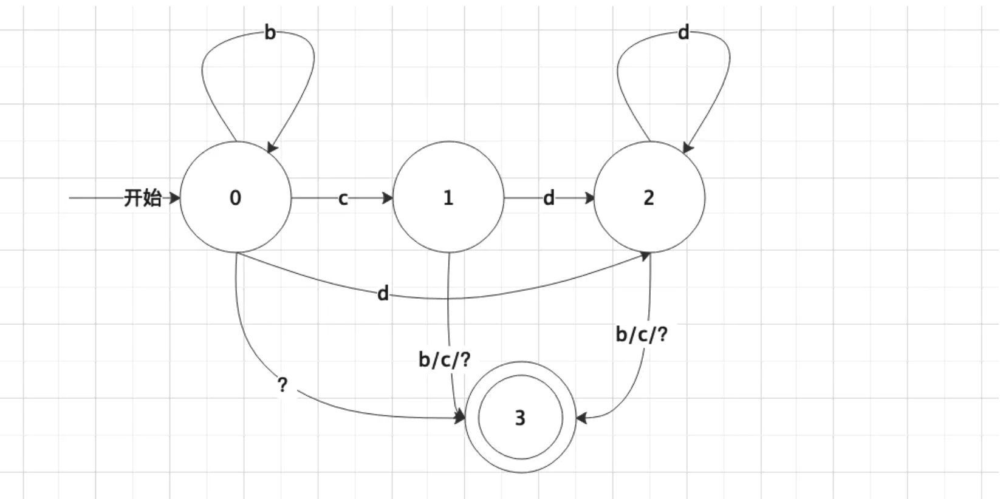

[TOC]

## 自动机分类

有限自动机可分为**确定的有限自动机（DFA**）和**不确定的有限自动机（BFA）**。区别在于转移函数不同，DFA对每一个可能的输入只有一个状态的转移，BFA对每一个可能的输入可以有多个状态转移，接受到输入时从这多个状态转移中非确定地选择一个。


## 适应问题

字符串匹配、转换。

## 求解基本步骤

1. 构造所有状态

2. 构造转移矩阵

   

## [字符串转换整数 (atoi)](https://links.jianshu.com/go?to=https%3A%2F%2Fleetcode-cn.com%2Fproblems%2Fstring-to-integer-atoi%2F)

```c++
函数 myAtoi(string s) 的算法如下：

读入字符串并丢弃无用的前导空格
检查下一个字符（假设还未到字符末尾）为正还是负号，读取该字符（如果有）。 确定最终结果是负数还是正数。 如果两者都不存在，则假定结果为正。
读入下一个字符，直到到达下一个非数字字符或到达输入的结尾。字符串的其余部分将被忽略。
将前面步骤读入的这些数字转换为整数（即，"123" -> 123， "0032" -> 32）。如果没有读入数字，则整数为 0 。必要时更改符号（从步骤 2 开始）。
如果整数数超过 32 位有符号整数范围 [−231,  231 − 1] ，需要截断这个整数，使其保持在这个范围内。具体来说，小于 −231 的整数应该被固定为 −231 ，大于 231 − 1 的整数应该被固定为 231 − 1 。
返回整数作为最终结果。
注意：

本题中的空白字符只包括空格字符 ' ' 。
除前导空格或数字后的其余字符串外，请勿忽略 任何其他字符。
```



### 状态

```python

class Solution:
    def getIndex(self, c):
        if c >= '0' and c <= '9':
            return 'n'
        elif c == ' ':
            return 'b'
        elif c == '+' or c == '-':
            return 's'
        else:
            return 'o'

    def myAtoi(self, s: str) -> int:
        state = [
            {'n' : 2, 'b' : 0,'s' : 1,'o' : 3}, 
            {'n' : 2, 'b' : 3,'s' : 3,'o' : 3},
            {'n' : 2, 'b' : 3,'s' : 3,'o' : 3}
        ]
        n = 0 
        flag = 1
        p = 0
        i = 0
        while i < len(s):
            c = s[i]
            to = self.getIndex(c)
            p = state[p][to]
            if p == 0:
                n, flag = 0, 1
            elif p == 1:
                flag = (1 if c == '+' else  -1)
            elif p == 2:
                n = n * 10 + ord(c) - ord('0')
            elif p == 3:
                break
                
            i += 1
        n = n * flag
        maxNumber,minNumber = 2**31 - 1,-2 ** 31
        if n > maxNumber:n = maxNumber
        if n < minNumber:n = minNumber
        return n
```

```

```

