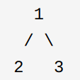

[TOC]

# 排列与组合

dp问题中循环的顺序导致的 排列数 和 组合数的区别 [link](https://leetcode-cn.com/problems/coin-change-2/solution/)


# 字符串

## split字符串

```c++
std::vector<std::string> split(const string& s, const string& delim){
	std::vector<std::string> ret;
	char * pch;
	pch = strtok(const_cast<char*>(s.c_str()),delim.c_str());
	while (pch != NULL)
	{
		ret.push_back(string(pch));
		pch = strtok(NULL, delim.c_str());
	}
	return ret;
}
```


# [原地置换](https://leetcode-cn.com/problems/find-all-numbers-disappeared-in-an-array/)

`数组去重` ：s.t. 数组的元素都在 [0 - n] 之间。

```c++
vector<int> ret;
for (int i = 0; i < nums.size(); ++i){
    int temp = nums[i];
    //判断 nums[nums[i]] 是否归位
    while (nums[temp] != temp){
        swap(nums[temp] , temp);
    }
}
for (int i = 0; i< nums.size() ; ++i){
    if (nums[i] != i){
        ret.push_back(i);
    }
}
return ret;
```

# 滑动窗口

```c++
int l = 0, r = 0;
data = [];
windows = []
while (r < len){
    windows.append(data[r]);
    while (l <= r && 不满足条件){
        windows.popfront(data[l]);
        l++;
    }
    if (满足条件){
        更新结果
    }
	r++;    
}
```

## 窗口最值

- [可删除的堆]()

- [单调队列](https://leetcode-cn.com/problems/sliding-window-maximum/submissions/)

- 窗口单调队列

  ```c++
  int l = 0 , r = 0;
  int q[1000] = {};
  int head = 0, tail = 0;
  while (r < len){
      while (tail != head && q[tail - 1] < nums[r]){
          tail--;
      }
      q[tail++] = nums[r];
      
      while (r - l + 1 > k){
          if (nums[l] == q[head]){
              head++;
          }
          l++;
      }
      if (r - l + 1 == k){
          cout << q[head] << endl;
      }
      r++;
  }
  ```
  
  
  
  
  
  

# 位运算

## Bits

- **分类** ：用某一个bit，可以将数组划分为两类。

## XOR 

- **去重**： $a \hat{}  a = 0$

[[数组中数字出现的次数](https://leetcode-cn.com/problems/shu-zu-zhong-shu-zi-chu-xian-de-ci-shu-lcof/)](https://leetcode-cn.com/problems/shu-zu-zhong-shu-zi-chu-xian-de-ci-shu-lcof/submissions/)

利用 整个数组的 异或 结果中的某一位为 1， 即目标两个数字可以通过该bit 进行区分。
借此将整个数组划分为两个组，然后分别异或，得到结果。


# 单调栈与单调队列


保持单调递减

```c++
class MonotonicQueue {
private:
    deque<int> data;
public:
    void push(int n) {
        while (!data.empty() && data.back() < n) 
            data.pop_back();
        data.push_back(n);
    }
    
    int max() { return data.front(); }
    
    void pop(int n) {
        if (!data.empty() && data.front() == n)
            data.pop_front();
    }
};


class MonotonicStack {
private:
    stack<int> data;
public:
    void push(int n) {
        while (!data.empty() && data.top() < n) 
            data.pop();
        data.push(n);
    }
    
    int top() { return data.top(); }
    
    void pop() {data.pop();}
};

```

# KMP


```c++
class Solution {
public:
    void GetNext(string p,int next[])  
    {  
        int pLen = p.length(), k = -1,j=0;  
        next[0] = -1;  
        while (j < pLen - 1){  
            if (k == -1 || p[j] == p[k])   {  
                ++k;  
                ++j;  
                next[j] = k;  
            }  
            else k = next[k];  
        }  
    }  
    int strStr(string s, string p) {
        if(p.length()==0) return 0;
        if(s.length()==0) return -1;
        int next[100000];
        GetNext(s,next);
        int i = 0,j = 0,sLen =s.length(),pLen = p.length();  
        while (i < sLen && j < pLen){  
            if (j == -1 || s[i] == p[j]){//①如果j = -1，或者当前字符匹配成功（即S[i] == P[j]），都令i++，j++ 
                i++;  
                j++;  
            }  
            else{//②如果j != -1，且当前字符匹配失败（即S[i] != P[j]），则令 i 不变，j = next[j]   
                j = next[j];//next[j]即为j所对应的next值             
            }  
        }  
        if (j == pLen)  
            return i - j;  
        else  
            return -1; 
        }
};
```


# 回文串

- 数据处理方法

  ​		**abac** --> **#a#b#a#c#**

  ​		解决了 回文串的奇偶奇异问题。

  ```c++
  string construct(const string s){
      string ret(2 * s.size() + 1, '#');
      for (int i = 0, sz = s.size(); i < sz; ++i)
          ret[2 * i + 1] = s[i]
      return ret;
  }
  ```

- 中心扩展

- dp

  ​	

  ```c++
  string s = "abccbad";
  
  bool dp[1000][1000];
  int len = s.size();
  for (int i = s.size() - 1; i >= 0; --i){
      for (int j = i; j < s.size(); j ++){
          if (i == j){
              dp[i][j] = true;
          }
          else if (s[i] == s[j] ){
              if (i + 1 == j)
                  dp[i][j] = true;
              else if (i + 1 <= j - 1){
  	            dp[i][j] = dp[i + 1][ j - 1];
              }
          }
          else dp[i][j]  = false;
      }
  }
  ```

  

  

- 

- manacher


# [链表相交](https://leetcode-cn.com/problems/intersection-of-two-linked-lists-lcci/)


- 两个链表先求出长度，然后尾部对齐，再从头遍历。

- **浪漫相交**

  ​		把 `NULL`  也当做相交节点。 
  
  ```c++
  ListNode *getIntersectionNode(ListNode *headA, ListNode *headB) {
          ListNode *p = headA;
          ListNode *node2 = headB;
          
          while (p != q) {
              p = p == NULL ? headB : p->next; //这里判断 p == NULL 而不是 p->next == NULL 是为了让 p 为 NULL ，用来判断 p == q == NULL, 即两个链表不相交。
              q = q == NULL ? headA : q->next;
          }
          return node1;
    }
  ```

# [中位数](https://leetcode-cn.com/problems/shu-ju-liu-zhong-de-zhong-wei-shu-lcof/)

- 对顶堆，e.g.  一个大顶堆，一个小顶堆，维持两个堆的数量相差不超过1。


# 可以删除元素的堆

利用建立两个相同的堆，对齐堆顶来保证已经被删除的元素出队。

```c++
struct Heap{
    priority_queue<int> q1,q2;
	inline void push(int x){
        q1.push(x);
    }
	inline void erase(int x){
        q2.push(x);
    }
	inline void pop(){
        while(q2.size()&&q1.top()==q2.top()){
            q1.pop(),q2.pop();
        }O
        if(q1.size())
            q1.pop();
    }
	inline int top(){
        while(q2.size()&&q1.top()==q2.top()){
            q1.pop(),q2.pop();
        }
        return q1.top();
    }
	inline int size(){return q1.size()-q2.size();}
};
```

# [序列与反序列化二叉树](https://leetcode-cn.com/problems/xu-lie-hua-er-cha-shu-lcof/)



- 前序序列化 `1 2 # # 3 # # `。
- 反序列化的时候先 split(' '),  之后按照字符串跑 前序遍历即可。

# 并查集

```c++
int f[10001] = {};
int r[10001] = {};
int n ;

void init(){
    for (int i = 0; i< 10001; i++){
        f[i] = i;
    }
}
int find(int n){
    if (f[n] == n) return n;
    int res = find(n);
    f[n] = res;// 直接指向根节点,减少查询时间复杂度
    return res;
}
void merge(int a ,int b){
    int fa = find(a), fb = find(fb);
    if (fa == fb)
     	return;
    if (r[fa] < r[fb]) //通过 r[fa] rank 来优化根节点，保持低rank的指向高rank。
        swap(fa, fb);
    f[fb] = fa;
   	if (r[fa] == r[fb])
        	r[fa] ++;
}
```

# 搜索

## A* \ BFS \ Dijkstra

本质上以上三种算法都可以是一个模板，基本都是使用了一个**广度优先思想**，不同在于，当发现当前的路径不能到达终点的时候，算法应该从回溯到何处，接着开始。

$ F = G + H $ 


$ F $ 代表了最终的$ cost $ 、 $ G $ 代表当前点到起点的距离、 $ H $ 代表到终点的距离，如此可以在搜索失败的时候，从已经打开的集合里面回溯一个最可能接近终点的点。

如果 $ A* $ 保持一个常数，那么 $ A* $ 就退化成为 BFS ， 如果考虑。$ H $ 为常数， 那么$A*$ 就退化称为 $Dijkstra$。

```c++
struct myPoint{
    myPoint(int _x, int _y) : x(_x), y(_y){
    }
    int x = 0;
    int y = 0;
    double G = 0, H = 0, F = 0;
    int last_x = -1, last_y = -1;
    bool operator<(const myPoint& _b) const {
        return F > _b.F;
    }
};

double cost(const myPoint& _cur,  const myPoint& _end){
    double ret = 0;
    double x2 = (_end.x - _cur.x) , y2 = (_end.y - _cur.y);
    // ret = sqrt(x2 * x2 + y2 * y2);
    ret = (x2 * x2 + y2 * y2);
    return ret;
}

void A_star(Grid& grid, int sx, int sy, int tx, int ty){
    
    // 已经探索过
    vector<vector<bool>> close_set(grid.w_, vector<bool>(grid.h_, false));

    // 打开了，但是还没有探索，可以回溯。
    priority_queue<myPoint> open_set;
    
    // 记录最有的路径。
    vector<vector<pair<int,int>>> last_point(grid.w_, vector<pair<int,int>>(grid.h_, {-1,-1}));
    vector<vector<double>> best_distance(grid.w_, vector<double>(grid.h_, 99999999));
    
    auto can_not_move = [](const myPoint& a, Grid& grid){
        if( a.x < 0 || a.y <0 || a.x >= grid.w_ ||a.y >= grid.h_) return true;
        return false;
    };

    auto is_visited = [&close_set](const myPoint& a){
        return  (close_set[a.x][a.y]);
    };

    myPoint sp(sx, sy), ep(tx, ty);
    sp.G = 0;
    sp.H = cost(sp, ep);
    sp.F = sp.G + sp.H;
    last_point[sp.x][sp.y] = {-1, -1};
    open_set.push(sp);
    // const int D[8][2] = {{0,1},{-1,1}, {-1,0}, {-1, -1}, {0, -1}, {1, -1}, {1, 0}, {1, 1}};
    const int D[4][2] = {{0,1}, {-1,0},  {0, -1}, {1, 0}};
    while (open_set.empty() == false){
        auto cur = open_set.top();
        open_set.pop();
        if (is_visited({cur.x, cur.y})) continue;
        close_set[cur.x][cur.y] = true;
      
        if (cur.x == tx && cur.y == ty){
            cout << "find " << endl;
            // trace path
            vector<myPoint> trace;
            int _x= cur.x , _y = cur.y;
            while (_x != -1 &&  _y != -1){
                trace.push_back({_x,_y});
                int a= last_point[_x][_y].first , b = last_point[_x][_y].second;
                _x=a ;
                _y=b;
            }
            break;
        }
      
        for (int i = 0; i< 4; i ++){
            int nx = D[i][0] + cur.x;
            int ny = D[i][1] + cur.y;
            if (can_not_move({nx, ny}, grid)) continue;
            if (is_visited({nx, ny})) continue;
            if (grid[ny][nx] == 0) continue;
            // 计算 cost 
            myPoint np(nx, ny);
            np.G =cur.G + 1;
            np.H = cost(np, ep);
            np.F = np.G + np.H;
            np.last_x = cur.x;
            np.last_y = cur.y;
            open_set.push(np);
            if (np.G < best_distance[np.x][np.y]){
                best_distance[np.x][np.y] = np.G;
                last_point[np.x][np.y] = {cur.x, cur.y};
            }
        }
    }
}
```


## 双向BFS

## 迭代加深DFS

## 其他技巧

